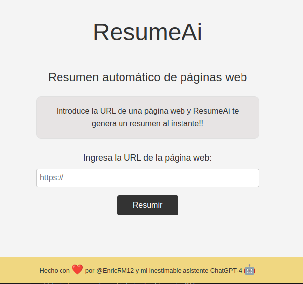

# ResumeAI

ResumeAI ha sido creada por ChatGPT4 como asistente. Es una aplicación web en Python que utiliza Flask para generar un resumen de una página web a partir de una URL introducida por el usuario. Para ello se conecta al api de openai y genera un resumen con el modelo tdavince (se puede elegir el que se quiera).
El proyecto incluye un archivo index.html, un archivo styles.css y un archivo app.py



## Configuración del entorno
Para poder utilizar ResumeAI, es necesario seguir los siguientes pasos:

1. Clonar el repositorio

```bash
git clone https://github.com/tu-usuario/ResumeAI.git
```

2. Crear y activar un entorno virtual:
```bash
conda create --name resumeai python=3.9
conda activate resumeai
```

3. Instalar dependencias
```bash
pip install -r requirements.txt
```

## Ejecución de la aplicación
Para ejecutar la aplicación, simplemente ejecuta el siguiente comando en el directorio raíz del proyecto:

```bash
python3 resumeai/app.py
```

Después de ejecutar el comando, podrás acceder a la aplicación a través de tu navegador web en http://localhost:5000/.

## Funcionamiento de la aplicación
Al acceder a la aplicación, el usuario verá un campo de texto en el que podrá introducir la URL de la página web que desea resumir. Tras hacer clic en el botón "Resumir", la aplicación generará un resumen de la página web y lo mostrará en un cuadro de texto debajo del campo de entrada.

## Autores
@ChatGPt4 y [@EnricRM12](https://twitter.com/EnricRM12 "Twitter")

## Licencia

Este proyecto está bajo la licencia MIT.